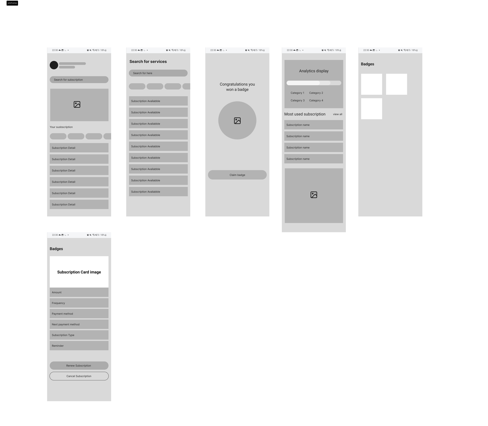
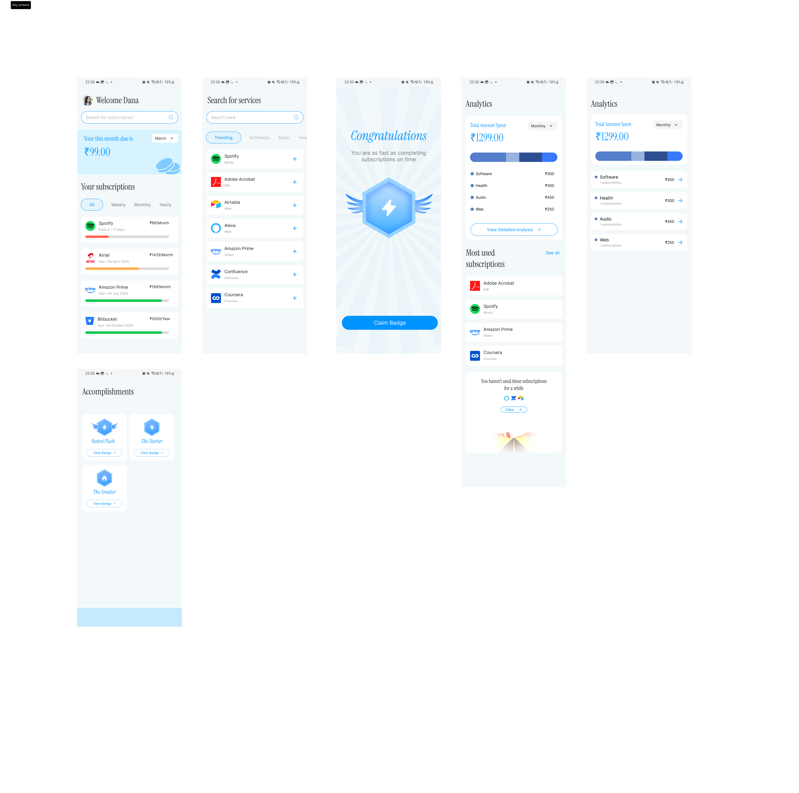
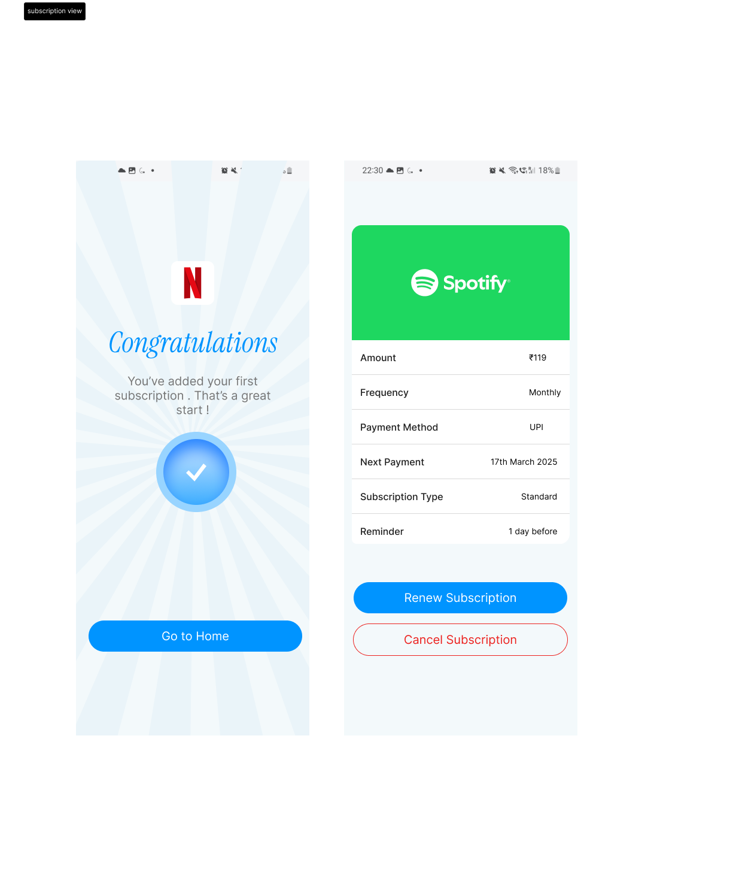

# Subscription Management Application

## Project Overview

The Subscription Management Application is a Business Analysis and Product Design project focused on solving challenges associated with managing recurring digital subscriptions.

The solution enables users to track subscriptions, monitor recurring expenses, receive renewal reminders, analyze spending patterns, and improve financial awareness through a centralized dashboard.

---

## Business Problem

Modern users subscribe to multiple digital services such as Netflix, Spotify, Amazon Prime, Coursera, SaaS tools, and productivity platforms.

Common challenges include:

* Forgetting renewal dates
* Paying for unused subscriptions
* Lack of visibility into recurring expenses
* Difficulty managing subscriptions across platforms
* Poor spending awareness

---

## Solution

The Subscription Management Application provides:

* Centralized subscription tracking
* Renewal reminder notifications
* Spending analytics dashboard
* Subscription search and management
* Gamified achievement badges
* Expense visibility and insights

---

## Key Features

* Subscription Dashboard
* Subscription Search
* Renewal Reminder System
* Spending Analytics
* Subscription Details View
* Subscription Cancellation Tracking
* Achievement & Badge System

---

## Design Process

### Wireframes

### High-Fidelity Designs

### Subscription View

---

## User Personas

The solution was designed around multiple user segments:

* Students
* Working Professionals
* Business Owners
* Freelancers
* Software Developers

---

## Skills Demonstrated

* Business Analysis
* Requirements Gathering
* User Persona Development
* User Journey Mapping
* Product Thinking
* Feature Prioritization
* Wireframing
* UI/UX Design
* Figma Prototyping
* Business Requirements Documentation (BRD)

---

## Project Resources

### Figma Prototype

https://www.figma.com/design/Hzdwq6LHVPbmgTA5T47WYf/Subscription-Tracking-App?node-id=0-1&t=ooar6AZRlGg7FI5I-1

### Business Requirements Document (BRD)

https://app.notion.com/p/Subscription-Management-Application-37ad4819a825809e9410c06ac194973b?source=copy_link

### Case Study

https://app.notion.com/p/Subscription-Management-Application-Case-Study-37ad4819a825809fbf8cd7df3600c9d6?source=copy_link

---

## Project Outcome

This project demonstrates an end-to-end Business Analysis process from problem identification and requirement gathering to persona creation, journey mapping, feature prioritization, and solution design.

The result is a user-centered subscription management solution designed to improve subscription visibility, spending awareness, and renewal management.
